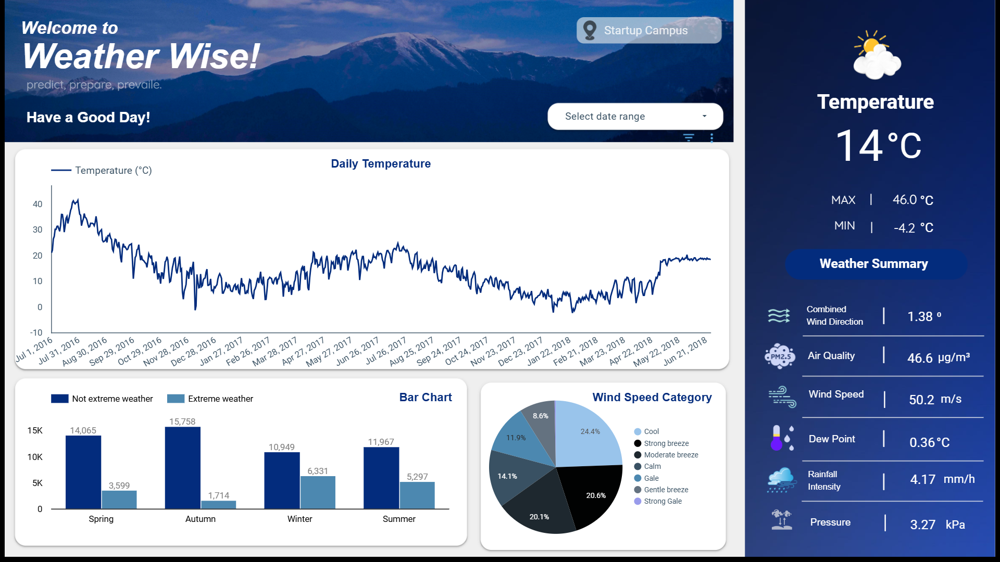
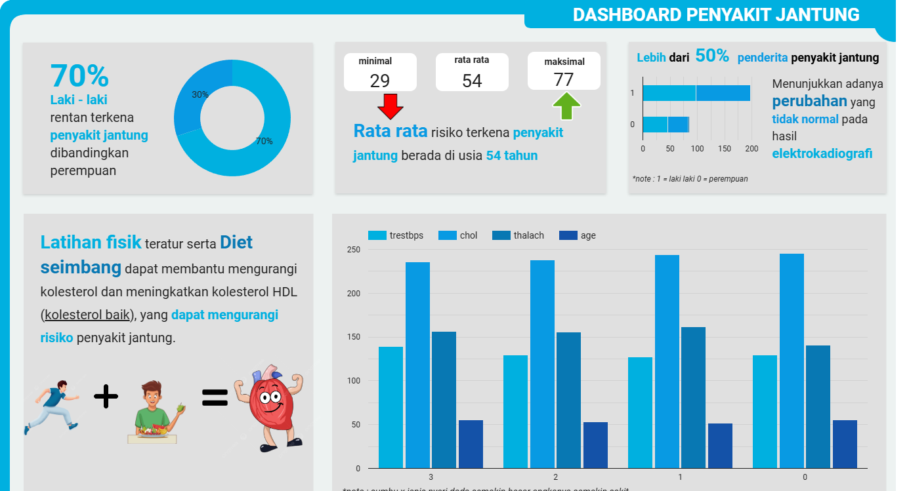
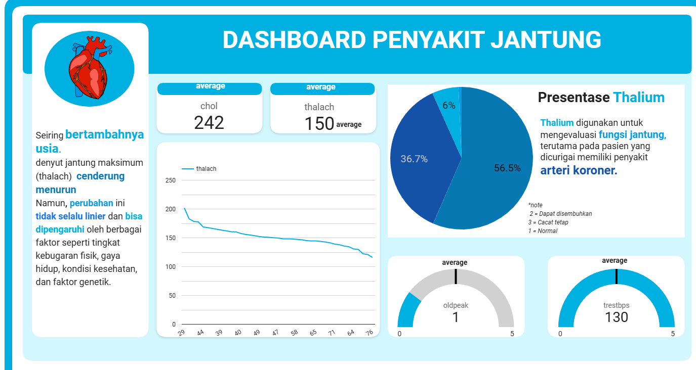

## Daftar Isi
- [Weather Wise – Dashboard Cuaca](#weather-wise--dashboard-cuaca)
- [Dashboard Penyakit Jantung1 – Faktor Risiko](#dashboard-penyakit-jantung--faktor-risiko)
- [Dashboard Penyakit Jantung2 – Analisis Klinis](#dashboard-penyakit-jantung--analisis-klinis)

---

## Weather Wise – Dashboard Cuaca
Dashboard ini menampilkan analisis data cuaca harian yang mencakup tren suhu dari waktu ke waktu, kondisi cuaca ekstrem dan non-ekstrem berdasarkan musim, serta kategori kecepatan angin.  
Selain itu, dashboard menyajikan ringkasan kondisi cuaca terkini seperti suhu, kualitas udara, kecepatan angin, curah hujan, dan tekanan udara untuk membantu pemantauan dan pengambilan keputusan berbasis cuaca.

**Preview Dashboard:**

---

## Dashboard Penyakit Jantung1 – Faktor Risiko

Dashboard ini menyajikan analisis faktor risiko penyakit jantung berdasarkan data pasien, mencakup perbedaan risiko antara laki-laki dan perempuan, distribusi usia, serta indikator klinis seperti kolesterol, tekanan darah, detak jantung maksimum, dan hasil elektrokardiografi.  
Visualisasi ini bertujuan membantu memahami pola risiko penyakit jantung serta pentingnya gaya hidup sehat seperti olahraga teratur dan diet seimbang dalam menurunkan risiko.

---

## Dashboard Penyakit Jantung2 – Analisis Klinis
Dashboard ini menampilkan analisis indikator klinis penyakit jantung yang berfokus pada hubungan usia dengan denyut jantung maksimum (thalach), kadar kolesterol, tekanan darah istirahat, serta hasil pemeriksaan thallium.  
Visualisasi membantu memahami bagaimana faktor usia dan kondisi klinis memengaruhi fungsi jantung serta mengidentifikasi potensi risiko penyakit arteri koroner.

