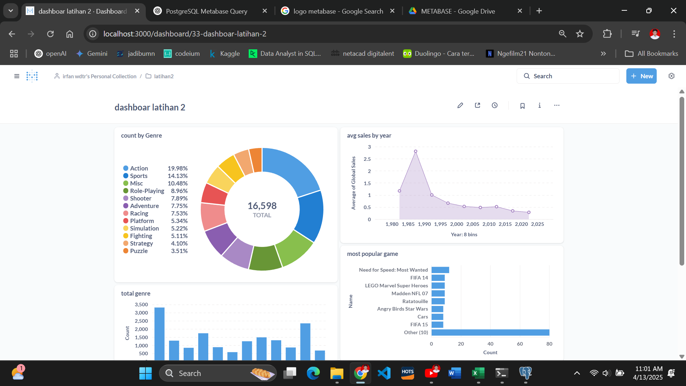

Dashboard ini menampilkan analisis data penjualan game yang mencakup distribusi jumlah game berdasarkan genre, tren rata-rata penjualan global per tahun, serta daftar game paling populer. 
Visualisasi membantu memahami genre yang paling dominan, perubahan performa penjualan dari waktu ke waktu, dan judul game dengan tingkat popularitas tertinggi.

