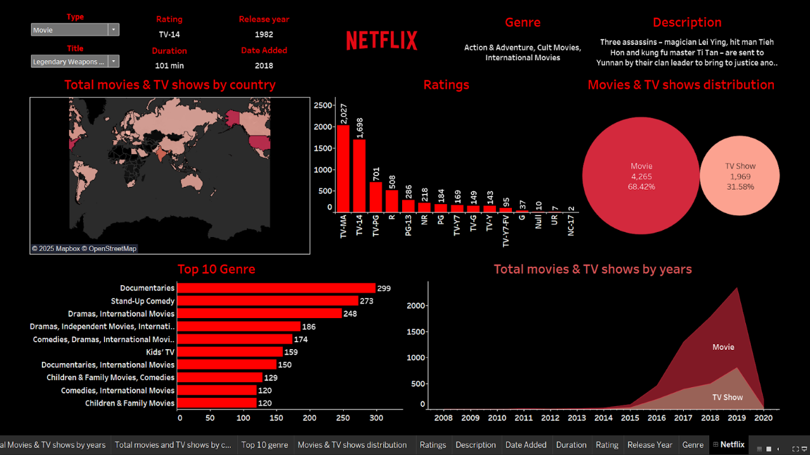
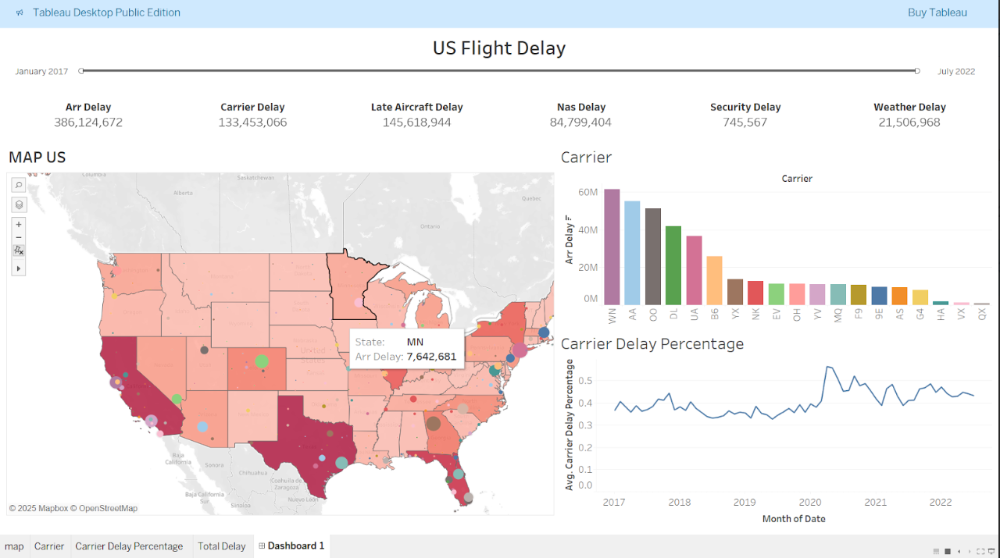

# Dashboard Portfolio

## Daftar Isi
- [Netflix Dashboard](#netlix-dashboard)
- [Flight Delay Dashboard](#flight-delay-dashboard)

## Netflix Dashboard
Dashboard ini menampilkan analisis katalog Netflix yang mencakup distribusi Movie dan TV Show berdasarkan negara, genre, rating, serta tahun rilis. 
Visualisasi membantu mengidentifikasi dominasi konten Movie dibandingkan TV Show, genre paling populer, persebaran global konten, serta tren pertumbuhan jumlah konten Netflix dari tahun ke tahun.

## Flight Delay Dashboard
Dashboard ini menganalisis keterlambatan penerbangan di Amerika Serikat periode Januari 2017 hingga Juli 2022. 
Analisis mencakup total keterlambatan berdasarkan penyebab (carrier, late aircraft, NAS, cuaca, dan keamanan), persebaran keterlambatan antar negara bagian, serta performa maskapai dan tren persentase keterlambatan dari waktu ke waktu untuk mengidentifikasi sumber utama dan pola delay penerbangan.

