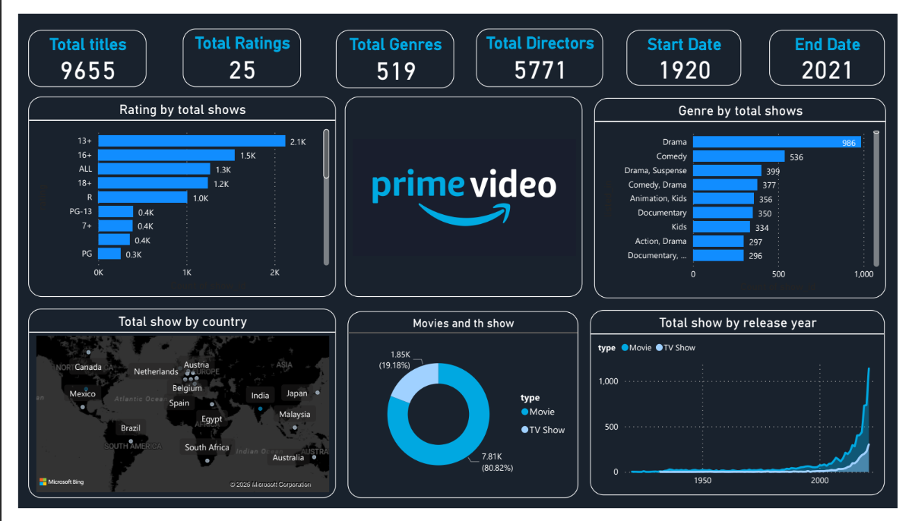
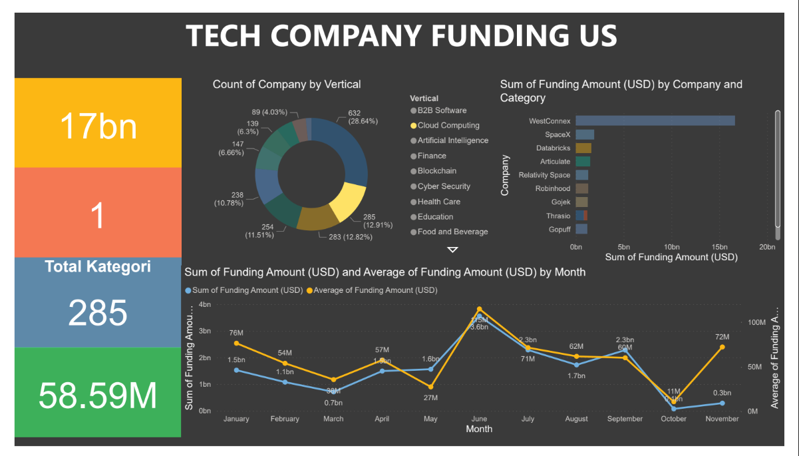
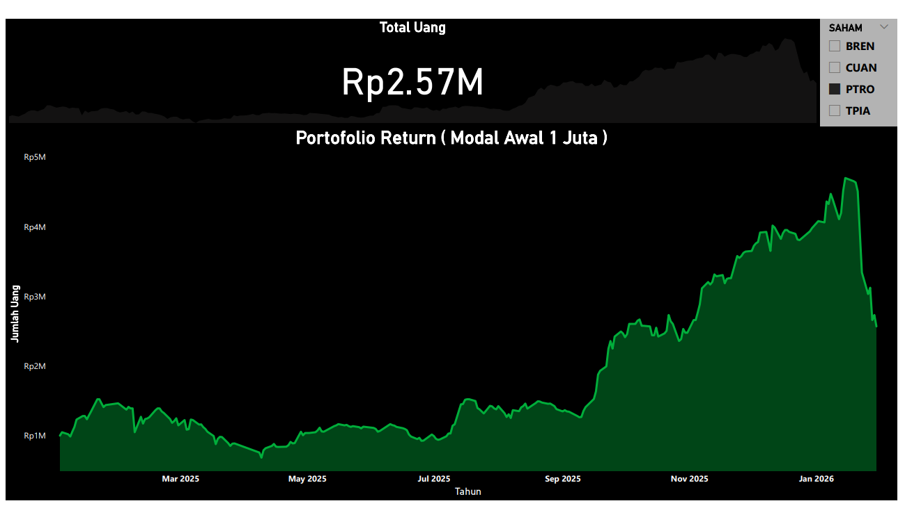

## Daftar Isi
- [Prime Video Dashboard](#prime-video-dashboard)
- [Tech Company Funding US](#tech-company-funding-us)
- [BikeStore Sales](#bikestore-sales)
- [Portofolio Return](#portofolio-return)

## Prime Video Dashboard
Dashboard ini menampilkan gambaran katalog Prime Video periode 1920–2021 dengan total 9.655 judul. 
Analisis mencakup distribusi konten berdasarkan rating, genre, negara, tahun rilis, serta perbandingan Movie dan TV Show untuk melihat tren pertumbuhan dan fokus konten.

## Tech Company Funding US
Dashboard ini menampilkan analisis pendanaan perusahaan teknologi di Amerika Serikat dengan total pendanaan mencapai USD 17 miliar. 
Visualisasi mencakup distribusi jumlah perusahaan berdasarkan sektor industri, perusahaan dengan total pendanaan terbesar, serta tren total dan rata-rata pendanaan per bulan untuk mengidentifikasi pola investasi sepanjang waktu.

## BikeStore Sales
Dashboard ini menampilkan analisis penjualan Bike Stores dengan total penjualan sebesar 5.22M. 
Visualisasi mencakup performa penjualan berdasarkan nama toko, kategori sepeda, serta tren penjualan bulanan untuk mengidentifikasi toko dan produk dengan kontribusi penjualan tertinggi serta pola penjualan dari waktu ke waktu.

## Portofolio Return
Dashboard ini menampilkan kinerja portofolio saham dengan modal awal Rp1.000.000 dan total nilai portofolio mencapai Rp2,57 juta. 
Visualisasi menunjukkan perkembangan nilai portofolio dari waktu ke waktu serta kontribusi masing-masing saham (BREN, CUAN, PTRO, dan TPIA) untuk memantau pertumbuhan, fluktuasi, dan performa investasi secara keseluruhan.

